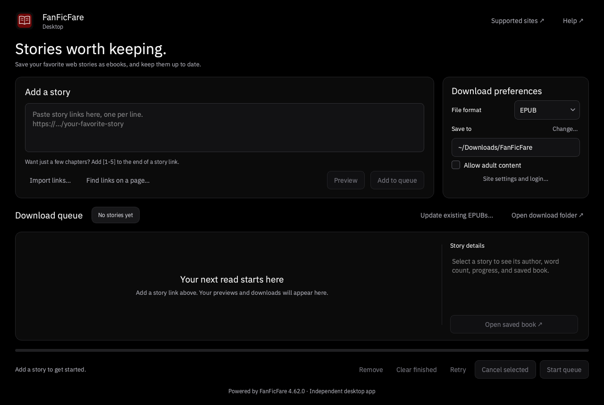

# FanFicFare Desktop

A standalone desktop interface for [JimmXinu/FanFicFare](https://github.com/JimmXinu/FanFicFare), built with Python and PySide6 (Qt). Designed for macOS, Windows, and Linux.

[](https://github.com/thatosxguy/fanficfare-desktop/actions/workflows/check.yml)



## Download

Get the packaged app from [GitHub Releases](https://github.com/thatosxguy/fanficfare-desktop/releases/latest). Python is included; no separate Python installation is needed.

- **macOS (Apple Silicon):** extract the ZIP and move `FanFicFare Desktop.app` to Applications.
- **Windows (x86-64):** extract the ZIP and open `FanFicFare Desktop.exe` inside the application folder.
- **Linux (x86-64):** extract the TAR.GZ and run `./FanFicFare\ Desktop` inside the application folder. The release is tested on Ubuntu 24.04.

Keep the extracted application folder intact, including `_internal` on Windows and Linux. These are portable archives, not installers. Builds are not signed for distribution or notarized; the operating system may display a security prompt. Each release includes SHA-256 checksums and a companion archive of dependency notices and source references. An Intel Mac package is not currently available.

## Features

- Paste multiple story URLs or import a UTF-8 text file, one URL per line.
- Preview story metadata without creating an ebook.
- Download EPUB, TXT, MOBI, or HTML (ZIP with supporting files).
- Extract links from a page or series into the input box for review.
- Update existing FanFicFare EPUBs, reuse existing chapters, and back up originals.
- Up to two simultaneous jobs with individual chapter progress, cancellation, errors, and retry.
- Page/image loading activity, elapsed time, and a visible word-count column.
- Fast previews without cover downloads; five-minute session reuse of preview metadata and the pages used to fetch it.
- HTTP connection reuse between jobs, shared site request pacing, and cached counts for unchanged EPUBs.
- Queue updates change only the affected row; text counting avoids building another HTML tree.
- Select a `personal.ini` for login, cookies, and site-specific settings.
- Open saved books or the output folder in the OS default application.

## Run from source

Requires Python 3.10 or newer and a supported Qt platform. Development was verified with Python 3.12 on macOS.

macOS / Linux:

```sh
python3 -m venv .venv
.venv/bin/python -m pip install -e '.[dev]'
.venv/bin/python -m fanficfare_gui
```

Windows (PowerShell):

```powershell
py -3.12 -m venv .venv
.venv\Scripts\python -m pip install -e ".[dev]"
.venv\Scripts\python -m fanficfare_gui
```

Installed command: `fanficfare-desktop`.

## Use

1. Paste links, choose a format and destination, and click **Add to queue**.
2. Click **Start queue**. Select a row to inspect metadata or errors.
3. Use **Update existing EPUBs…** to select existing books. Backups appear in `FanFicFare Backups` beside each updated book. An EPUB with no new chapters remains unchanged.

**Preview** and **Find links on a page…** also add jobs; click **Start queue** to run them. Extracted links appear in the input box and are not automatically downloaded. URL chapter ranges such as `https://…/story[1-5]` work for downloads. Open **Site settings and login…** in Download preferences to choose or clear a `personal.ini` file; a configured file is indicated on the button.

The queue is kept in memory for the current session. Destination, format, and the selected INI path are saved in the OS settings store. INI contents and adult-content consent are not saved by the GUI. Settings are captured when each job is added; retry uses the currently selected INI and consent.

Two workers stay open between jobs and run at most two jobs simultaneously. Requests for the same source, including updates to the same resolved EPUB path, run sequentially. The scheduler prefers the worker that previously handled a source or saved book so its cached information can be reused. Each worker retains recent metadata and the pages used to fetch it for up to five minutes. Cache groups are separated by site, format, INI contents, adult-access confirmation, and applicable story-specific INI sections. Changes to the selected INI invalidate reuse. Chapter pages are discarded between jobs. HTTP and CloudScraper connections are reused within those groups; other proxy fetchers retain upstream behavior. Closing the app or cancelling a worker clears that worker's caches; raw pages and login cookies are never saved to disk by this feature.

Both workers coordinate uncached request starts using the site's configured `slow_down_sleep_time` and any adapter override. FanFicFare's own random sleeps and retry backoff remain enabled. A temporary coordination database stores only site names and pacing timestamps and is deleted on normal app exit. Cached pages do not wait for pacing. Parallel jobs help overlap work, especially across different sites; a site's required delays still limit downloads from that site.

Word counts reported by a site are labeled as such. If the site does not provide a count (including the current Literotica adapter), the app calculates one from downloaded chapter text and includes it in the saved ebook. Until then the preview shows that a count is unavailable. Calculated counts include the text in the downloaded chapters, including notes or headings present in that text; they are not official site totals. An EPUB update with no new chapters can show a calculated count from the existing chapters without rewriting the book. Counts are cached in memory by a SHA-256 fingerprint of the complete EPUB, so unchanged books avoid repeated chapter parsing; changes to the file invalidate the cached count. The bounded count cache lasts for the worker's lifetime.

## Appearance

The interface uses black and near-black surfaces, white text, muted secondary text, and oxblood accents. Rounded panels group story links, download preferences, and the queue. IBM Plex Sans and its OFL notice are bundled for consistent typography. A neutral open-book icon identifies the app. The empty queue explains how to get started, and advanced site configuration opens in a separate settings dialog.

## Configuration and file handling

Only FanFicFare's packaged defaults and your explicitly selected INI are read. Existing Calibre libraries and CLI configuration files are not automatically used. See upstream's [configuration guide](https://github.com/JimmXinu/FanFicFare/wiki/Configuration) and [example.ini](https://github.com/JimmXinu/FanFicFare/blob/main/fanficfare/example.ini) for site login and browser-cookie options. Treat an INI containing passwords or cookies as private; `personal.ini` is ignored by Git.

FanFicFare handles site support, authentication, and network access. Site-specific restrictions and browser challenges may require configuration. Interactive password and two-factor prompts are not yet implemented. This version uses the library API and does not execute CLI pre/post-process shell hooks or import books into Calibre.

New downloads never overwrite an existing filename; duplicates get a numbered suffix. A download is staged and checked before publication. Atomic publication uses a hard link on the destination filesystem, so choose a local filesystem with hard-link support (typical APFS, NTFS, ext4). An unsupported destination returns an error. EPUB updates are staged beside the original, validated, backed up, and replaced atomically. Updates stop if the source has fewer chapters or the original changes during the download. Metadata/cover refresh with unchanged chapter counts is not included in this version.

Select an active row and click **Cancel selected** to stop that job and remove its staging folder. The other active job finishes, and remaining jobs stay queued until **Start queue** is clicked again. Cancellation is disabled during that job's final save. Closing with active jobs asks whether to cancel them; closing waits while a final save is in progress. An OS or power failure can leave a `.fff-work-*` staging folder, which can be removed when no job is running.

## Verify and build

```sh
python -m pytest -q
python scripts/build.py
python scripts/smoke_bundle.py
python scripts/package.py
python scripts/benchmark.py
```

Use the virtual environment's Python for these commands. On headless Linux, set `QT_QPA_PLATFORM=offscreen` for tests.

The benchmark measures local word counting on synthetic chapter text; it does not measure live website download speed. See [performance verification](docs/performance.md) for the measured result and test scope.

PyInstaller builds a native app in `dist/`. Build on each target OS; it does not cross-compile. The packaging script creates a ZIP for macOS/Windows or a TAR.GZ for Linux under `dist/artifacts/`. macOS and Linux archives preserve executable permissions and symlinks.

[GitHub Actions](https://github.com/thatosxguy/fanficfare-desktop/actions/workflows/check.yml) runs tests, native builds, and packaged-app smoke checks on macOS, Windows, and Linux. Successful runs upload native app archives as workflow artifacts, available from the run's page when signed into GitHub. Development artifacts have an outer ZIP that must also be extracted. Public release packages are available directly from [GitHub Releases](https://github.com/thatosxguy/fanficfare-desktop/releases/latest). Distribution signing, notarization, and installers are not included in the current release.

## License

The desktop interface is licensed under [Apache-2.0](LICENSE). See [NOTICE](NOTICE) for attribution. Bundled fonts and installed dependencies retain their own licenses.

## Attribution

This is an independent interface, not an official FanFicFare release. The downloading engine and site adapters belong to the [FanFicFare contributors](https://github.com/JimmXinu/FanFicFare). Their license and notices remain with the installed dependency; upstream declares Apache-2.0 in its [package metadata](https://github.com/JimmXinu/FanFicFare/blob/main/pyproject.toml) and includes additional notices in [LICENSE](https://github.com/JimmXinu/FanFicFare/blob/main/LICENSE). PySide6 is provided by the Qt project under its applicable licenses. Review bundled third-party licenses before distributing builds.
